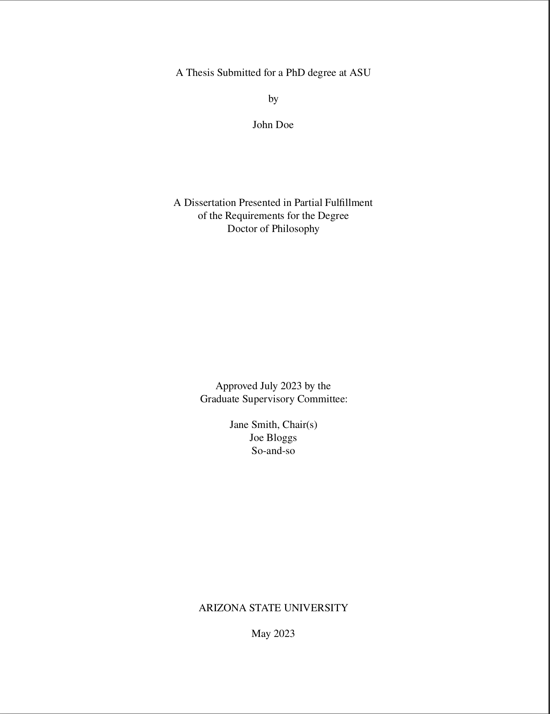
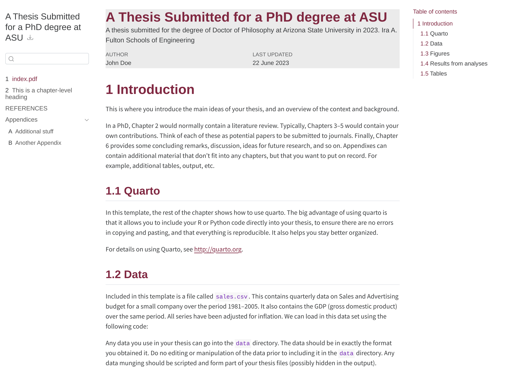

# Quarto Template/Extension for ASU Thesis

<!-- WARNING -->

> It is highly recommended to use `tinytex` which comes with Quarto for rendering the PDF format. You may get warnings if using`texlive` and may need to debug (very frustrating) and install packages manually. `tinytex` can update missing libraries for you. See more on [Quarto website](https://quarto.org/docs/output-formats/pdf-engine.html).

## Background

This repo provides a Quarto template/extension to assist the preparation of a thesis/report/dissertation according to ASU guidelines.

In addition to the [office guide](https://graduate.asu.edu/current-students/completing-your-degree/formatting-your-thesis-or-dissertation), I burrowed ideas from the following sources.

* The pandoc LaTex template for the PDF format was roughly based on the LaTex [`ASU-Dissertation-Template`](https://github.com/GarenSidonius/ASU-Dissertation-Template).

Modifications were made to the headings, captions and bibliography.

* The repo and `_quarto.yml` structure was inspired by other quarto thesis extensions [`quarto-thesis`](https://github.com/nmfs-opensci/quarto-thesis) and [`monash-quarto-thesis`](https://github.com/numbats/monash-quarto-thesis/tree/main).

## Use as a `github` template

1. Click the green button `Use this template` to create a new repo for your own.
2. Update the metadata in the `_quarto.yml` file based on your personal and thesis information
3. Update the contents for your chapters, appendices, front and back matters such as abstract (required), dedication, acknowledgement, biosketch, and your bibliography file.
  You can always preview the rendering of the book, `quarto preview`. You can specific the preview format, e.g., `quarto preview --to asuthesis-pdf`
4. Update the list of chapters in `_quarto.yml` again
5. Render the book to multiple formats in the root repo directory `quarto render`

## Use as a Quarto extension

See [Quarto guide](https://quarto.org/docs/extensions/managing.html)

## Examples

